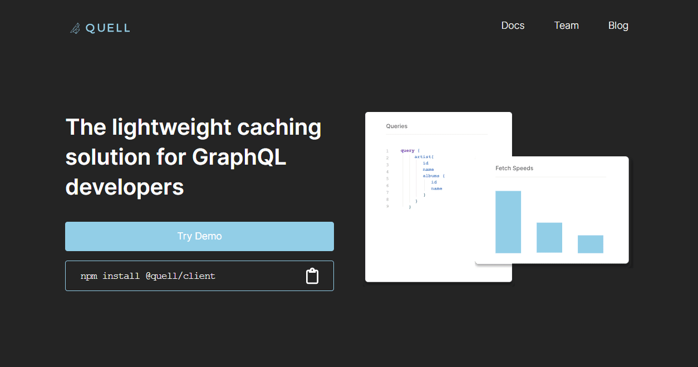
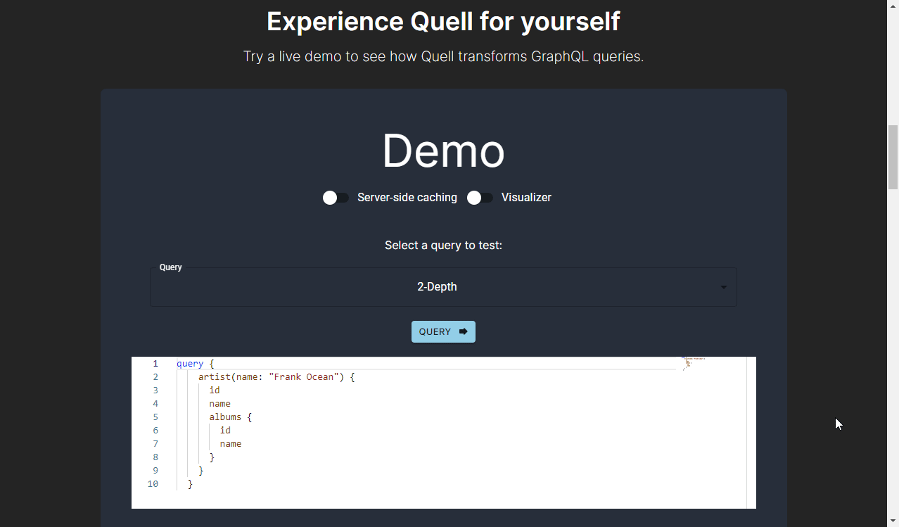

# QuellDemo

Welcome to the developer playground for GraphQL caching tool, Quell. 

- Querying: Observe Quell's ability to facilitate GraphQL queries and mutations using Quell-Client OR Quell-Server.
- Caching: Observe client-side and server-side caching of queries and mutations and therefore, reduced query and mutation speeds.

This app is currently deployed on our website: [Quell](https://quell.dev/) 

  

 

# Features

- Users can utilize the new toggle button to separate client-side and server-side graphs and receive immediate feedback/demonstration of the corresponding Quell querying and caching logic.

- Server-side Demo for Quell now allows for user selection of maximum cost, maximum depth, and IP rate limitation so that query and query frequency cannot exceed selections before making a successful query. Includes more informative client and server error messages when query costs, depths, and rates exceed pre-selected values.

- The query menu has a delete mutation selection to add to the variety of GraphQL queries users can try with Quell.

- With each query, users can view the cache hit vs. cache miss ratio visual graphic to gauge how query speeds correlate with cache hits (querying from caches) or misses (querying from databases).

- The query graph now incorporates more informative x, y axes for graph interpretation, and a reset graph button to clear graph query columns to avoid page refreshes.

- The website facilitates a more intuitive user experience with new feature labeling and is also now mobile-friendly.

- Our execution context visualizer for GraphQL queries provides a clear and intuitive representation of the query execution process along with displaying field resolver resolution speeds, enabling developers to easily understand and debug complex query workflows.

#### Quell-Client:

#### Quell-Server:

